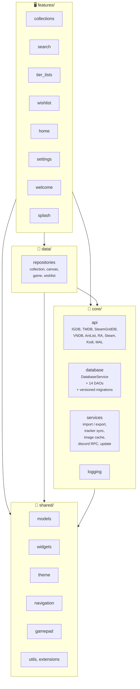

[← Back to README](../README.md)

# Architecture

High-level map of the project. Specific files and signatures live in the code — this document explains **where things live and why**, not what each file does line-by-line.

## Overview

Cross-platform Flutter app for managing collections of retro games, movies, TV shows, anime, manga, visual novels, and user-authored custom items. Integrates with IGDB, TMDB, SteamGridDB, VNDB, AniList, RetroAchievements, MyAnimeList, Steam, Trakt, Simkl, and Kodi.

| Layer    | Stack |
|----------|-------|
| UI       | Flutter (Material 3, dark theme) |
| State    | Riverpod (`NotifierProvider`, `AsyncNotifierProvider`, `.family`) |
| Database | SQLite — `sqflite_common_ffi` on desktop, native `sqflite` on Android |
| HTTP     | Dio |
| Platforms | Windows, Linux, Android (some features are Windows-only; see `lib/shared/constants/platform_features.dart`) |

---

## Architecture diagram



Dependencies flow strictly top to bottom: `features → data → core`, with `shared` underneath everything. Cycles like `core → features` are forbidden.

---

## Project structure

```
lib/
├── main.dart                 Entry point: SQLite init, ProviderScope overrides
├── app.dart                  TonkatsuBoxApp — MaterialApp, theme, _AppRouter
├── core/                     Depends on nothing but shared/
├── data/                     Repositories: coordinate core APIs and DAOs
├── features/                 Screens, providers, widgets — one folder per feature
├── l10n/                     ARB files (en + ru) + generated S
└── shared/                   Models, widgets, theme, navigation, gamepad
```

---

## Layers

### `core/`

- **`api/`** — Dio-based HTTP clients. Each client is its own class exposed through a `Provider`. Auth (Twitch OAuth for IGDB, Bearer for TMDB / SteamGridDB, etc.) lives inside the client. Errors are normalized into custom `*ApiException` types via `api_error_extract.dart`.
- **`database/`** — `DatabaseService` (singleton via `databaseServiceProvider`) delegates CRUD to DAOs. Schema is declared in `schema.dart` (`DatabaseSchema.create*Table`). Migrations are incremental: one file per version under `migrations/`, registered in `MigrationRegistry.all`. **Never edit historical migration SQL** — add a new version instead.
- **`services/`** — anything that's not an API client and not raw CRUD: `.xcoll` / `.xcollx` import/export, tracker sync (RA, Steam, Trakt, Kodi, MAL, AniList), Discord RPC, update checker, image cache, config.
- **`import/`** — library import layer (ports & adapters). The `ImportSource` port with one adapter per source under `sources/<name>/`, plus shared domain pieces (`ImportWriter` for collection write, `TmdbMatcher`, `RateLimitedRetry`). **Kinorium, Steam, Trakt, Simkl, RetroAchievements, MyAnimeList and AniList** are all adapters on the layer, each implementing `ImportSource` and writing through `ImportWriter`. The `.xcoll` / `.xcollx` collection-file import (`services/import_service.dart`) stays separate by design — it restores a snapshot rather than resolving titles against an external catalog. See [core/import/README.md](../lib/core/import/README.md).
- **`logging/`** — wrapper around `package:logging`. `print` is forbidden in production code.

### `data/`

Repositories coordinate multiple sources (API + DAO + cache) and hide the details from features. They hold no state — Riverpod in `features/` does.

### `features/`

Each feature is a self-contained folder with three subdirectories:

- `screens/` — pages (`StatelessWidget` / `ConsumerStatefulWidget`).
- `providers/` — Riverpod notifiers and `FutureProvider`s scoped to the feature.
- `widgets/` — feature-local reusable widgets.

A feature may add folders when it needs them: `statistics` also has `models/`, plus `views/` and `layout/` for its per-form-factor split. Where desktop and mobile lay a page out differently enough that one widget tree with branches inside would be harder to read than two, each form factor gets its own file (`statistics_view_desktop.dart` / `statistics_view_mobile.dart`, `stats_hero_desktop.dart` / `stats_hero_mobile.dart`), the parts that do not differ stay in a shared `*_common.dart`, and the numbers each layout feeds its sections live in an immutable spec (`StatsLayout`) with one `const` per form factor, published to the sections through an `InheritedWidget`. The page picks the file by measured content width via `LayoutBuilder`, not `MediaQuery` — the nav shell makes the window width overstate the room the content gets.

Current features: `collections` (main module — collection screens, ItemDetail, canvas, panels), `search` (universal search via `SearchSource` over 22 registered sources), `tier_lists` (Tier list + Mood Grid), `wishlist`, `home` (All Items), `personalization` (hub over `statistics`, `genre_cloud`, `recommendations`, `showcase`, `likes`), `statistics` ("my library in numbers": SQL aggregates via `StatsDao`, share card), `settings` (19 screens: credentials, imports, debug), `welcome` (6-step onboarding), `splash`.

### `shared/`

- **`widgets/`** — shared widgets: `ScreenAppBar`, `CachedImage`, `MediaPosterCard`, `SourceBadge`, `StarRatingBar`, etc.
- **`theme/`** — `AppColors`, `AppTypography`, `AppSpacing`, `AppTheme` (Material 3 dark).
- **`navigation/`** — `NavigationShell` (Rail on desktop, BottomBar on mobile).
- **`gamepad/`** — gamepad events, `InputMode`, `GamepadListener`. See [GAMEPAD.md](GAMEPAD.md).

### `packages/core/`

A pure-Dart package (no Flutter dependency) holding the data layer the app shares with the planned selfhost server, imported as `package:core/...`:

- **`models/`** — all immutable models with `fromJson` / `fromDb` constructors and `toDb` / `copyWith` methods. List them with `ls packages/core/lib/models/`. Purity is enforced by construction: `core` does not depend on Flutter, so `dart analyze` inside the package rejects any `package:flutter` / `dart:ui` / l10n import. Presentation (colors, icons, localized labels) lives in `lib/shared/constants/*_ui.dart` extensions on the app side.
- **`database/`** — `schema.dart` DDL helpers and `migrations/` (see [Database](#database)).
- **`utils/`** — pure helpers the models need: `bbcode`, `html_text`, `stable_id`, `cover_image_id`, `tvmaze_json`, `kitsu_status`, `anime_manga_title_language`.

### `server/`

The selfhost server (pure Dart, shelf), outside the Flutter build graph — the app never imports it and it never imports the app; both depend on `packages/core`. It owns the database file in a volume, replays the same migration chain on boot, and serves the `flutter build web` output. It dispatches DAO calls over `/rpc`: `packages/core/tool/generate_rpc.dart` reads the DAO signatures and emits both the browser-side stubs and the server-side dispatcher into `packages/core/lib/rpc/generated/`. Wire contract in `server/PROTOCOL.md`, run instructions in `server/README.md`.

---

## Database

The source of truth is `packages/core/lib/database/schema.dart` (table list) and `lib/core/database/database_service.dart` (the current `version` in `_initDatabase`). Those numbers change with every migration, so this document **doesn't quote them** — grep the code instead.

The schema and the migration chain live in `packages/core`, a pure-Dart package with no Flutter dependency, so the same code can build and upgrade the database outside a Flutter app. `database_service.dart` keeps the CRUD and the `dart:io` path handling.

Key entities:

- **`collections`** + **`collection_items`** — user collections and their members. `collection_id` is nullable; `NULL` means uncategorized.
- **`collection_items.media_type`** — discriminator: `game` / `movie` / `tvShow` / `animation` / `anime` / `manga` / `visualNovel` / `book` / `audio` / `custom`. `external_id` points at a row in the matching cache table.
- **Media cache tables**: `games`, `movies_cache`, `tv_shows_cache` (+ `tv_seasons_cache`, `tv_episodes_cache`), `anime_cache`, `manga_cache`, `visual_novels_cache`, `books_cache`, `audio_cache` (+ `audio_tracks_cache`), `custom_items`. These are local mirrors of API responses keyed by external id (IGDB / TMDB / AniList / VNDB / OpenLibrary / Fantlab). `manga_cache`, `books_cache` and `tv_shows_cache` (with its season/episode tables) use a composite key `(id, source)` since two providers can share a numeric id.
- **`canvas_items` / `canvas_connections` / `canvas_viewport`** — the Board. Lives at both the collection level and the per-item level (`game_canvas_viewport`).
- **`watched_episodes`** — episode-watch marks for TV shows, keyed by `(collection_id, source, show_id, season, episode)`.
- **`listened_tracks`** — the audio tracker's marks, keyed by `(collection_id, source, audio_id, disc, track)`; podcast episodes use `disc = 0` and the Podcast Index episode id as `track`. Independent from `watched_episodes`.
- **`wishlist`** — quick free-text "look it up later" notes.
- **`collection_tags`** — sub-categories inside a collection.
- **`tier_lists` / `tier_definitions` / `tier_list_entries`** — Tier list.
- **`mood_grids` / `mood_grid_cells`** — Mood Grid (an N×M board of labelled cells).
- **Tracker tables**: `tracker_profiles` (connected accounts), `tracker_game_data` (per-game, per-platform progress), `tracker_achievements` (RA achievements).
- **Static lookup tables**: `platforms`, `tmdb_genres`, `igdb_genres`, `vndb_tags` — seeded by migration v24 and preserved across "wipe user data".

### Platform quirks

- Sort-critical strings are stored lowercase (Cyrillic-safe). SQLite's `LOWER()` does not handle non-ASCII, so case folding happens in Dart.
- Unicode unique indexes use `COALESCE(col, -1)` so two `NULL`s collapse to the same bucket — without it, SQLite would treat them as distinct values.

---

## State management (Riverpod)

| Pattern | When to use |
|---------|-------------|
| `Provider` | Singletons: API clients, `DatabaseService`, repositories. |
| `NotifierProvider` | Synchronous state with actions (filters, screen-local settings). |
| `AsyncNotifierProvider` | Data loads with loading/data/error through `asyncValue.when()`. |
| `.family` | Whenever state is parameterised (`collectionId`, `(showId, season)`, etc.). |
| `FutureProvider` | One-off fetched values without actions (genre maps and such). |

We don't keep a central provider index — it rots fast. Find providers with `grep -rln "Provider<\|NotifierProvider\|AsyncNotifier" lib/`.

### Per-profile SharedPreferences keys

Any user-specific preference key **must** be suffixed with `_<profileId>` and read through a getter (don't cache it in a field — the active profile can change at runtime). Global keys (API credentials, theme, language) are the exception.

---

## Navigation

```
SplashScreen
  └── _AppRouter
        ├── (no API key)  → SettingsScreen(isInitialSetup: true)
        └── (has API key) → NavigationShell
              ├── AllItemsScreen
              ├── HomeScreen (Collections)  → CollectionScreen → ItemDetailScreen → SearchScreen
              ├── WishlistScreen            → SearchScreen
              ├── SearchScreen
              └── SettingsScreen            → Import/Export, Debug
```

Navigation is imperative `Navigator.push(MaterialPageRoute(...))`. No `go_router`. Global D-pad / `ActivateIntent` handling is centralised in `NavigationShell`, so any focusable widget gets gamepad support for free. See [GAMEPAD.md](GAMEPAD.md).

---

## Key patterns

1. **Immutable models.** Every model in `packages/core/lib/models/` has `final` fields and a `copyWith()`. Direct mutation is forbidden — state changes go through Riverpod notifiers.
2. **Factory constructors.** Each model: `fromJson` (API), `fromDb` (SQLite), `toDb` (serialisation). Models that ship in `.xcoll` exports also implement the `Exportable` mixin with `toExport()`.
3. **`SearchSource` abstraction.** Universal search (`features/search/sources/`) gives features one interface over 7 different backends — no per-source `switch` in the UI.
4. **DB-first lookup-data cache.** Genre maps (TMDB / IGDB) and VNDB tags are seeded into SQLite by migration v24 and read locally. The network is only hit when the local row is missing — losing internet **does not break the filter UI**.
5. **Optimistic updates.** Status / rating changes update Riverpod state immediately; the DB write happens in the background. Notifiers `try/catch` the write to roll back on failure.
6. **Search debouncing.** Every text-driven search debounces by ≥400ms before hitting the network.
7. **`Future.wait` for parallel requests.** When two independent API calls go to the same backend (e.g. movie+tv on the Anime tab), launch them with `await Future.wait([...])`. Timeouts are bounded by the slowest response.
8. **Pluggable import sources (ports & adapters).** Library importers implement the `ImportSource` port and return a `UniversalImportResult`. The shared write-side (`ImportWriter`, which goes through the repositories, never the DAOs) and title matching (`TmdbMatcher`) are injected into each adapter, not inherited. A new source is a new adapter under `core/import/sources/` — see [core/import/README.md](../lib/core/import/README.md).

---

## Further reading

- **Commits, branches**: [COMMITS.md](COMMITS.md)
- **Code style, lints**: [CODESTYLE.md](CODESTYLE.md)
- **Contribution workflow**: [CONTRIBUTING.md](CONTRIBUTING.md)
- **Gamepad**: [GAMEPAD.md](GAMEPAD.md)
- **SnackBar API**: [SNACKBAR.md](SNACKBAR.md)
- **`.xcoll` / `.xcollx` format**: [RCOLL_FORMAT.md](RCOLL_FORMAT.md)
